<h1 align='center'>:tada: Jak Sie Masz :tada:</h1>

<h3 align='center'>I'm a fullstack vibe developer from 🇨🇳</h3>

<div align='center'>
  
</div>

---

<div align='center'>
  
</div>

---

#### Repos

[Readline ES](https://github.com/crapthings/readline-es) :heart: a tiny helper for read by line

[Clarity](https://github.com/crapthings/clarity) :bulb: boost your personal productivity with elegant tools and workflows.

[Meteor Storyboard](https://github.com/crapthings/meteor-storyboard) :pencil: AIGC storyboard made with Meteor.js

#### Stats



#### Skills

|| :+1: |
| --- | --- |
| language | javascript, typescript, coffeescript, solidity |
| framework | meteor, next.js |
| frontend | react |

#### Contact

:mailbox_with_mail: [crapthings@gmail.com](mailto:crapthings@gmail.com)

#### Scripts

* Install Docker

```
curl -sSL https://raw.githubusercontent.com/crapthings/crapthings/main/install-docker.sh | bash
```

* Install Portainer

```
curl -sSL https://raw.githubusercontent.com/crapthings/crapthings/main/install-portainer.sh | bash
```

* Install SS

```
curl -sSL https://raw.githubusercontent.com/crapthings/crapthings/main/install-ss.sh | bash
```

* Install Caddy

```
curl -sSL https://raw.githubusercontent.com/crapthings/crapthings/main/install-caddy.sh | bash
```

* Install BT

```
wget -O install.sh https://download.bt.cn/install/install-ubuntu_6.0.sh && sudo bash install.sh ed8484bec
```

* Install Mongodb

```
curl -sSL https://github.com/crapthings/crapthings/blob/main/install-mongodb.sh | bash
```

* Install NVM

```sh
curl -o- https://raw.githubusercontent.com/nvm-sh/nvm/v0.40.0/install.sh | bash
```

```sh
export NVM_DIR="$([ -z "${XDG_CONFIG_HOME-}" ] && printf %s "${HOME}/.nvm" || printf %s "${XDG_CONFIG_HOME}/nvm")"
[ -s "$NVM_DIR/nvm.sh" ] && \. "$NVM_DIR/nvm.sh" # This loads nvm
```

* Install NaiveProxy

```
git clone https://github.com/crapthings/docker-naive-proxy
cd docker-naive-proxy
sed -i 's/#domain#/xxx.xxx.xxx/g' config/Caddyfile
sed -i 's/#email#/xxx@xxx.xxx/g' config/Caddyfile
sed -i 's/#account#/user password/g' config/Caddyfile
docker compose up -d
```

* Mongodb

```
 docker run \
  --name mongodb \
  -v ./configdb:/data/configdb \
  -v ./db:/data/db \
  -p 27017:27017 \
  -d \
  mongodb/mongodb-community-server:latest
```
