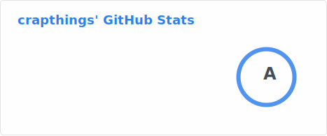

<h1 align='center'>:tada: Jak Sie Masz :tada:</h1>

  <a href='./index.html'><strong>Open My Landing Page</strong></a>

<h3 align='center'>I'm a fullstack vibe developer from 🇨🇳</h3>

  

---

  

---

#### Apps

[Fabulous Cutter](https://crapthings.github.io/fabulous-cutter/dist/) — Trim Fast. Export Clean.

[LLM Memory Calculator](https://crapthings.github.io/llmmc/) — Estimate VRAM for quantized LLMs

#### Repos

[Readline ES](https://github.com/crapthings/readline-es) :heart: a tiny helper for read by line

[Clarity](https://github.com/crapthings/clarity) :bulb: boost your personal productivity with elegant tools and workflows.

[Meteor Storyboard](https://github.com/crapthings/meteor-storyboard) :pencil: AIGC storyboard made with Meteor.js

[HiMirror](https://github.com/crapthings/HiMirror) :camera: a lightweight macOS menu bar app for live camera mirroring and framing.

[nb-cli](https://github.com/crapthings/nb-cli) :notebook: Nano Banana CLI tool to generate and edit images with Google Gemini directly from your terminal.

[Fabulous Summary](https://github.com/crapthings/fabulous-summary) :sparkles: A Chrome extension for fast page understanding with OpenRouter models (text/screenshot summary + Side Panel chat).

[Fabulous Cutter](https://github.com/crapthings/fabulous-cutter) :scissors: Local-first online tool to trim video and audio, multi-clip queue and batch export.

#### Stats

#### Skills

|| :+1: |
| --- | --- |
| language | javascript, typescript, coffeescript, solidity |
| framework | meteor, next.js |
| frontend | react |

#### Contact

:mailbox_with_mail: [crapthings@gmail.com](mailto:crapthings@gmail.com)
