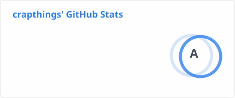

  <h1>Hi, I'm Zhanghong 👋</h1>
  

    
  

  

    Full-stack engineer and independent builder based in Harbin, China. 
    I make practical, AI-native tools for images, video, and the web.
  

  

    <a href="https://zhanghong.me"><strong>Website</strong></a>
    ·
    <a href="https://crapthings.github.io/crapthings/"><strong>Portfolio</strong></a>
    ·
    <a href="mailto:crapthings@gmail.com"><strong>Email</strong></a>
    ·
    <a href="https://soundcloud.com/drujk"><strong>Music</strong></a>
  

  

## What I build

- **Full-stack products** — from a thoughtful UI to agents, infrastructure, and a dependable deployment.
- **Developer tools** — small, focused utilities that remove friction from everyday engineering.
- **AI creative tools** — making image and video workflows faster, more approachable, and useful in real work.
- **Knowledge graphs & semantic systems** — RDF, SPARQL, and reasoning for interoperable data.

## AI & creative products

> I build creative tools that turn ambitious ideas into practical, everyday workflows.

| Project | What it does |
| --- | --- |
| [Storyboard Studio](https://github.com/crapthings/meteor-storyboard) | An AI-assisted, multi-shot studio for generating and managing media assets. |
| [Fabulous Cutter](https://github.com/crapthings/fabulous-cutter) | A local-first video and audio trimmer with multi-clip queues and batch export. |
| [Fabulous Summary](https://github.com/crapthings/fabulous-summary) | A Chrome extension for page summaries and Side Panel chat with OpenRouter models. |
| [Clarity](https://github.com/crapthings/clarity) | A local-first, AI-powered productivity tracker for turning screen activity into useful insights. |
| [HiMirror](https://github.com/crapthings/HiMirror) | A lightweight macOS menu bar app for live camera mirroring and framing. |
| [LLM Memory Calculator](https://crapthings.github.io/llmmc/) | Estimate the VRAM required to run quantized LLMs. |

## CLI tools

> The best tools stay out of the way: one command, a clear result, and no ceremony.

| Project | What it does |
| --- | --- |
| [nb-cli](https://github.com/crapthings/nb-cli) | Create and edit images with Gemini directly from the terminal. |
| [zit-cli](https://github.com/crapthings/zit-cli) | Generate images from the terminal with Z-Image Turbo. |
| [run3d](https://github.com/crapthings/run3d) | Create an interactive 3D prototype with React Three Fiber in one command. |

## Swift projects

> Small native apps should feel fast, focused, and unmistakably at home on the Mac.

| Project | What it does |
| --- | --- |
| [SweetUn](https://github.com/crapthings/SweetUn) | A tiny native macOS app for compressing and extracting archives, built with Swift and SwiftUI. |

## Open-source engineering

> Experiments become useful software when the foundations are thoughtful, dependable, and open.

| Project | What it does |
| --- | --- |
| [money-safe](https://github.com/crapthings/money-safe) | A TypeScript money library for minor units, rounding, allocation, and safe payloads. |
| [tsl-hex-tiling](https://github.com/crapthings/tsl-hex-tiling) | Non-repeating texture tiling for Three.js TSL, with WebGPU and WebGL 2 support. |
| [metal-hex-tiling](https://github.com/crapthings/metal-hex-tiling) | A Swift package for non-repeating, mip-correct texture tiling on Apple Metal. |

## Databases

> Data infrastructure should feel simple at the surface without hiding the power underneath.

| Project | What it does |
| --- | --- |
| [Meldbase](https://github.com/crapthings/meldbase) | An experimental embedded reactive document database for Go and TypeScript. |

## Networking

> Networking software should be fast, resilient, and understandable all the way down the stack.

| Project | What it does |
| --- | --- |
| [hysteria-rust](https://github.com/crapthings/hysteria-rust) | An independent Rust implementation of Hysteria 2 with QUIC and cross-platform networking. |

## Odin Projects

> A ground-up exploration of semantic systems, built for clarity, interoperability, and control.

| Project | What it does |
| --- | --- |
| [odin-garden](https://github.com/crapthings/odin-garden) | Cross-project contracts, integration fixtures, and verification for the Odin RDF, SPARQL, and reasoning ecosystem. |
| [odin-rdf](https://github.com/crapthings/odin-rdf) | Streaming-first RDF 1.1 parsers and writers for Odin. |
| [odin-graph](https://github.com/crapthings/odin-graph) | An experimental candidate for the in-memory RDF graph kernel, extracted only after cross-component integration evidence is stable. |
| [odin-store](https://github.com/crapthings/odin-store) | The planned durable RDF Dataset layer: persistence, atomic commits, recovery, and backend policy, built on the in-memory graph kernel. |
| [odin-reasoner](https://github.com/crapthings/odin-reasoner) | A bounded, forward-chaining RDF reasoner for Odin, with RDFS Core and a documented OWL 2 RL seed. |
| [odin-sparql](https://github.com/crapthings/odin-sparql) | A bounded, dataset-agnostic SPARQL 1.1 query parser and execution engine for Odin. |

## Beyond open source

Private product work has sharpened these capabilities:

- **Product delivery end to end** — interfaces, backend services, data, deployment, and observability.
- **Desktop & browser experiences** — cross-platform apps, extensions, and daily-use tools.
- **Generative-media pipelines** — storyboards, multimodal assets, and image/video workflows.
- **Agentic product systems** — LLM workflows, tool integrations, and production-ready automation.

## Toolkit

### Languages

  
  
  
  
  
  
  
  
  

### Frameworks & tools

  
  
  
  
  
  

### Cloud & infrastructure

  
  
  
  
  
  
  
  

## Work stats

## Elsewhere

- Portfolio: [zhanghong.me](https://zhanghong.me)
- Building in public: [github.com/crapthings](https://github.com/crapthings)
- Music: [soundcloud.com/drujk](https://soundcloud.com/drujk)
- Say hello: [crapthings@gmail.com](mailto:crapthings@gmail.com)
